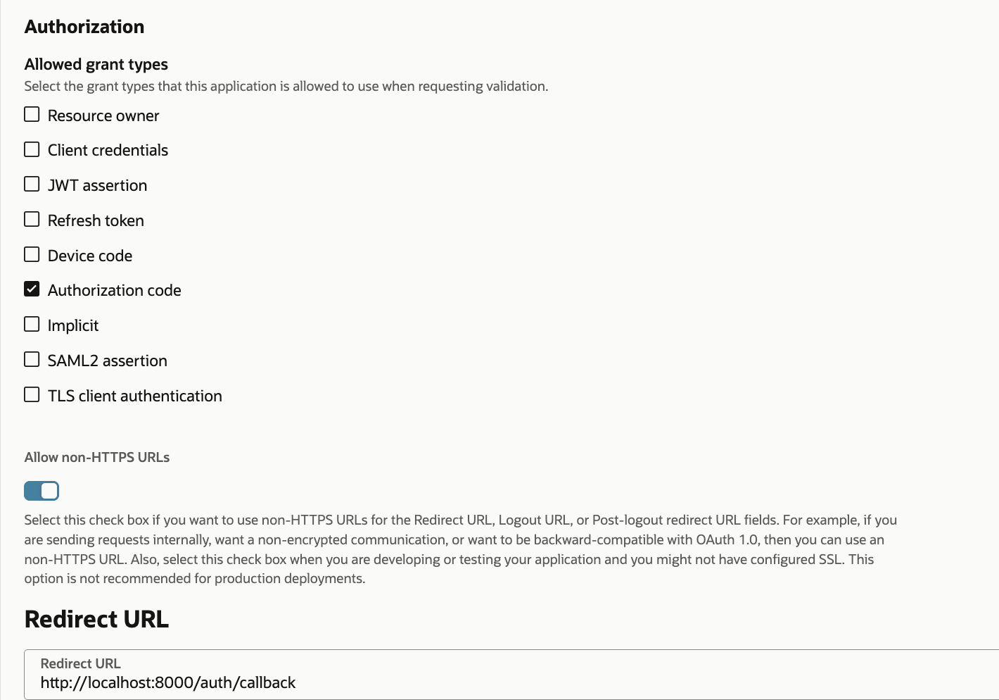

# OCI MCP Server
This is a sample code for MCP server to authenticate against OCI IAM service. You should do through testing and scanning on the code before using for any production usage.

# Getting Started
The MCP server uses OCI IAM domain for authentication. Once the user is authenticated, we use OCI token exchange to exchange access token for OCI session token. Both of these use cases require an OAuth application. You could use the same application for both the use cases.

## Create OAuth client for MCP server authentication
Follow the steps as mentioned below to create an OAuth client.

1. Login to OCI console (https://cloud.oracle.com for OCI commercial cloud).
2. From "Identity & Security" menu, open Domains page.
3. On the Domains list page, select the domain in which you want to create MCP server OAuth client. If you need help finding the list page for the domain, see [Listing Identity Domains.](https://docs.oracle.com/en-us/iaas/Content/Identity/domains/to-view-identity-domains.htm#view-identity-domains).
4. On the details page, select Integrated applications. A list of applications in the domain is displayed.
5. Select Add application.
6. In the Add application window, select Confidential Application.
7. Select Launch workflow.
8. In the Add application details page, Enter name and description as shown below.


9. Once the Integrated Application is created, Click on "OAuth configuration" tab.
10. Click on "Edit OAuth configuration" button.
11. Configure the application as OAuth client by selecting "Configure this application as a client now" radio button.
12. Select "Authorization code" grant type. If you are planning to use the same OAuth client application for token exchange then select "Client credentials" grant type as well. In the sample, we will use the same client.
13. For Authorization grant type, select redirect URL. This is, in most cases, will be MCP server URL followed by "/oauth/callback".



14. Click on "Submit" button to update OAuth configuration for the client application. 
**Note: You don't need to do any special configuration to support PKCE for the OAuth client.**
15. Make sure to Activate the client application.
16. Note down client ID and client secret for the application. Update .env file and replace IAM_CLIENT_ID and IAM_CLIENT_SECRET values. 
17. IAM_DOMAIN in the env file is the Identity domain URL that you chose for the MCP server.

This is all you need to implement MCP server authentication against OCI IAM. However, if you want to use authenticated user token to invoke OCI control plane APIs and propagate identity to the OCI control plane instead of using a service user account, then you need to implement token exchange.

## Make sure JWK's URL are made accessible without client credentials

1. Login to OCI console (https://cloud.oracle.com for OCI commercial cloud).
2. From "Identity & Security" menu, open Domains page.
3. On the Domains list page, select the domain that you are using for MCP Authentication.
4. Open Settings tab. 
5. Click on "Edit Domain Settings" button.


6. Enable "Configure client access" checkbox as show in the screenshot.


## Token Exchange Setup
Token exchange helps you exchange logged in user's OCI IAM token for OCI control plane session token aka. UPST. To learn more about token exchange, refer to my [Workload Identity Federation Blog.](https://www.ateam-oracle.com/post/workload-identity-federation)

For token exchange, we need to configure Identity propagation trust. The blog above talks more about setting up the trust using REST APIs. However, you can use oci cli as well. Before you use the cli command below, make sure to create token exchange OAuth client. In most cases, you can use the same OAuth client that you created above. You will use client ID of the token exchange OAuth client in the cli command below and replace it for {IAM_TOKENEXCHANGE_CLIENT_ID}. 

You will also need to update client secret for the token exchange OAuth client in .env file. It is IAM_TOKENEXCHANGE_CLIENT_SECRET parameter. Update IAM_GUID and IAM_TOKENEXCHANGE_CLIENT_ID as well for the token exchange OAuth client in the .env file.

```
oci identity-domains identity-propagation-trust create \
--schemas '["urn:ietf:params:scim:schemas:oracle:idcs:IdentityPropagationTrust"]' \
--name "For Token Exchange" --type "JWT" \
--issuer "https://identity.oraclecloud.com/" \
--endpoint "https://{IAM_GUID}}.identity.oraclecloud.com" \
--subject-claim-name "sub" --allow-impersonation false \
--subject-mapping-attribute "username" \
--subject-type "User" --client-claim-name "iss" \
--client-claim-values '["https://identity.oraclecloud.com/"]' \
--oauth-clients '["{IAM_TOKENEXCHANGE_CLIENT_ID}"]'
```

## Running MCP server
Once the setup is complete, to run the MCP server, run the below command.
```
fastmcp run server.py:mcp --transport http --port 8000
```

To run MCP client, run the below command.
```
python3 client.py
```

You can also use MCP interpreter to test MCP server.
```
fastmcp dev server.py
```

## Adding more OCI MCP servers

If you want to create MCP server for any OCI service, you can use OCI IAM for authentication and get_oci_signer method to get the signer object. Using signer object, you can instantiate any OCI client.

If you run into any issues, feel free to reach out to kiran.thakkar@oracle.com

# Contributing 
This project welcomes contributions from the community. Before submitting a pull request, please [review our contribution guide.](./CONTRIBUTING.md)